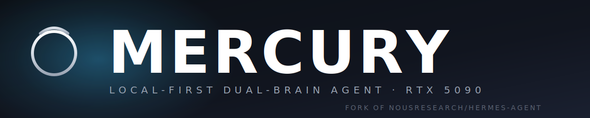
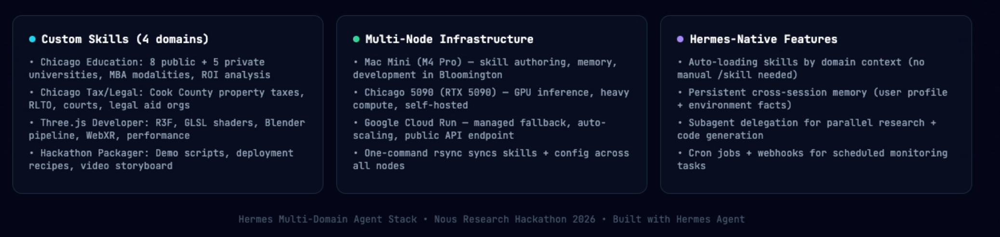
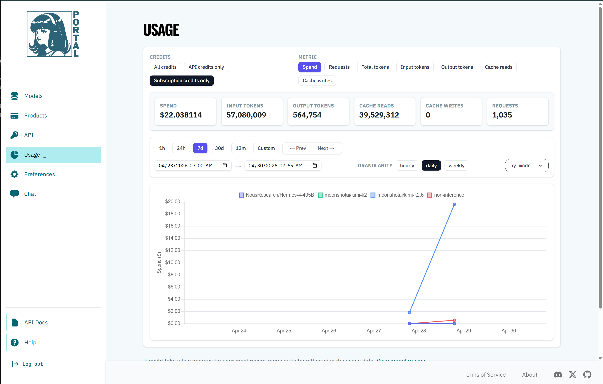

<p align="center">
  
</p>

# Mercury — Your AI on Your Hardware, Through Every Door You Own

**`ALEXIOS BLUFF MARA × ILLINOIS STATE UNIVERSITY`**
*Research conducted in association with [Illinois State University](https://illinoisstate.edu), Bloomington–Normal, IL.*

---

> One brain. One memory. Six doors — terminal, Discord, a web page, iMessage, email, your phone. The same agent answers, with the same memory, on hardware you own. No round-trips to anyone else's cloud.

Built for the [Nous Research × Kimi Creative Hackathon](https://nousresearch.com) (Creative track) by **Alexios Bluff Mara LLC (dba Red Team Kitchen)**.

Fork of [NousResearch/hermes-agent](https://github.com/NousResearch/hermes-agent) (MIT). Submitted May 3, 2026.

---

## The Six-Door Office — how Mercury works

Picture a small office with one occupant: an assistant who already knows you. They've read your notes, they remember last week's conversation, they know what tools you keep on your desk and what documents you keep in your filing cabinet. Most assistants today live in someone else's building — you walk in, they get amnesia, you start from scratch.

Mercury's office is in **your** building. The assistant lives on a single computer that you own — by default, an RTX 5090 desktop in Chicago. The desk has six doors:

- **The terminal door** — `mercury chat` from any shell, anywhere on your machine.
- **The Discord door** — Snowy The Bot, present in any server you invite it to.
- **The web door** — a chat surface on a private URL, reachable from a browser.
- **The iMessage door** — texts to a relay number, replies back to your phone.
- **The email door** — `you@redteamkitchen.com` becomes a working address for the agent.
- **The mobile door** — same chat, same memory, on the phone in your pocket.

Walk through any door, and you're talking to the same person. Tell it something on Discord at noon, ask about it from the terminal at four — it remembers. The brain is **Gemma 4 E4B** running locally via Ollama at 194 tok/s on the 5090. The orchestration layer is **Mercury Agent** — Nous Research's open-source framework. Mercury is what we built on top: a multi-domain skill stack and a six-surface gateway, designed so a single human can run a single agent across every device they own without ever sending a token to a cloud they don't control.

**Skills, not prompts.** Mercury ships with four specialist skill sets that compose tools out of a five-source data layer (filesystem, web search, browser MCP, Python exec, knowledge graph). The dispatcher auto-loads the right skill by domain context — no `/skill` slash commands, no manual routing. Add a fifth skill tomorrow without touching the agent loop.

**Local by default, cloud on demand.** When the 5090 is busy or offline, Mercury falls over to Google Cloud Run with the same Gemma 4 model. When it's back, the local path resumes automatically. You never see the cutover.

---

## Why it matters

Personal AI today comes in two shapes: a **chat box on someone else's website** (your conversation lives in their database) or a **wrapper around someone else's API** (every token is metered and logged). Both are useful. Neither is *yours*.

Mercury is the third shape: an agent that lives on hardware you bought, reading files you wrote, answering through channels you control. The implications follow:

- **Privacy is an architectural property, not a promise.** No data leaves the machine in the hot path. The default model never makes an outbound call. There is no "we promise we don't read your messages" clause to trust — there's no one to read them.
- **Cost converges to electricity.** After the GPU purchase, Mercury costs roughly $0.02 per hour to run at idle on grid power. There is no per-token bill, no monthly subscription, no rate limit beyond what the hardware can sustain.
- **Memory is yours.** Every conversation, profile fact, and skill output is written to `~/.mercury/` on your own filesystem. Back it up, port it, fork it. The agent that knows you isn't trapped in someone else's account.
- **The skills are forkable.** Mercury's four bundled skill domains (below) are the ones we needed. The hard work isn't writing skills — it's the dispatcher, the gateway, the multi-surface plumbing. Fork the dispatcher, write your own four skills, run your own version.

The cost case isn't subtle. An RTX 5090 runs about $2,500–3,000 street price. The equivalent cloud capacity is $0.70/hour for an L4 GPU on Google Cloud Run, or ~$504/month at 24/7 — break-even in five months even before counting the per-token fees that a hosted equivalent would charge. **Local AI is no longer a hobbyist tradeoff.** It's the cheapest deployment path that exists for an always-on personal agent.

---

## What Mercury is NOT

- **Not a chatbot wrapper.** Mercury runs an actual agent loop with tool use, memory, and skill dispatch — not a single-turn LLM call dressed up with a chat UI.
- **Not a hosted service.** There is no `app.mercury.com`. To run Mercury, you need your own GPU. We ship the code; you ship the hardware.
- **Not a Mercury Agent fork in name only.** Mercury is the Nous Research Mercury-agent codebase with a custom dispatcher, a six-surface gateway, four skill domains, and a Cortex-bridge — but the agent loop, tool router, and config schema are upstream Mercury. We send patches back when they're general-purpose.
- **Not for production at scale.** Mercury is a personal agent for a single user (or a small group). It is not designed to serve a thousand concurrent sessions. The whole point is that the GPU is yours.
- **Not a Kimi-only project.** Kimi K2.6 (via the Nous Portal) wrote the initial Cortex viewer in a 75-minute, 14-commit, $22.04 sprint — that is the Nous/Kimi track submission. The live agent runs entirely on Gemma 4 E4B locally. Kimi is acknowledged as the build collaborator, not a runtime dependency.

---

## The four skill domains

Mercury ships with four specialist skill bundles. Each one composes tools (filesystem, web, Python, browser, knowledge graph) into a workflow for a specific kind of question. Adding a fifth domain is a matter of writing a new YAML manifest and dropping it into `skills/` — no agent-loop changes.

| Domain | What it answers |
|---|---|
| **chicago-education** | Eight public + five private universities in greater Chicago, MBA modalities (full-time / part-time / EMBA / online), tuition + ROI analysis, transfer pathways. |
| **chicago-tax-legal** | Cook County property tax appeals, the Residential Landlord and Tenant Ordinance (RLTO), state and circuit court structure, legal aid org directory. |
| **threejs-design-dev** | React Three Fiber idioms, GLSL shader patterns, Blender → glTF pipeline, WebXR, performance budgets for in-browser 3D. |
| **nous-hackathon** | Submission packaging — demo scripts, deployment recipes, video storyboard, judge-checklist artifacts. (This skill wrote large parts of this README.) |

Why these four? They cover the four problems we needed solved while building Cortex: the team's school search (a return-to-grad-school question), the team's housing legal questions (Cook County renters), the actual 3D viewer code, and the hackathon submission itself. They are not a curated demo set — they are the live skills the team uses.

---

## Architecture

<p align="center">
  
</p>

Six client surfaces fan into a single Mercury Gateway. The gateway routes through a local Gemma 4 brain (Kimi K2.6 was used for the hackathon sprint), a tool router, a context-aware skill dispatcher, and a cross-session memory store. Four custom skill domains compose tools out of a five-source data layer. The whole stack runs across three nodes — a Mac Mini in Bloomington for skill authoring, a self-hosted RTX 5090 in Chicago for inference, and Google Cloud Run as managed fallback.

| Custom skills (4 domains) | Multi-node infra | Mercury-native |
|---|---|---|
| **chicago-education** — 8 public + 5 private universities, MBA modalities, ROI analysis | **Mac Mini (M4 Pro, Bloomington)** — skill authoring, memory, dev | Auto-loading skills by domain context (no manual `/skill` needed) |
| **chicago-tax-legal** — Cook County property taxes, RLTO, courts, legal aid orgs | **Chicago 5090 (RTX 5090)** — GPU inference, heavy compute, self-hosted | Persistent cross-session memory (user profile + environment facts) |
| **threejs-design-dev** — R3F, GLSL shaders, Blender pipeline, WebXR, performance | **Google Cloud Run** — managed fallback, auto-scaling, public API endpoint | Subagent delegation for parallel research + code generation |
| **nous-hackathon** — demo scripts, deployment recipes, video storyboard | One-command `rsync` syncs skills + config across all nodes | Cron jobs + webhooks for scheduled monitoring tasks |

```
Six doors           Mercury Gateway             Skills + Tools             Storage
─────────           ──────────────             ──────────────             ───────
terminal  ─┐                                                              ┌─ ~/.mercury/memory/
discord    │                                   ┌─ chicago-education       │   (cross-session profile)
web        ├─►   ┌─ tool-router  ─┐    ┌──►    ├─ chicago-tax-legal       │
imessage   │    ─┤  skill-disp.  ├─    │       ├─ threejs-design-dev      ├─ ~/.mercury/SOUL.md
email      │     └─ memory       ─┘    │       └─ nous-hackathon          │   (persona)
mobile    ─┘                           │           ↓                      │
                                       │       ┌─ filesystem  ─┐          ├─ knowledge-graph
                                       └──►    │ web-search    │           │   (~/.mercury/kg/)
                                               │ browser-mcp   ├─►        │
                                               │ python-exec   │           └─ Cortex API bridge
                                               └─ knowledge-graph          (D:/cortex via cortex-bridge)
```

### v1 → v2: what changed and why

| Surface | v1 (deprecated) | v2 (current) |
|---|---|---|
| Brain | Mercury 4 405B + Kimi K2.6 split-role planner/coder | Single Gemma 4 E4B locally (Kimi for build sprint only) — simpler, free, faster |
| Skill model | Three demo skills hard-coded into the agent loop | Skill Dispatcher auto-loads by domain context — 4 domains today, n+1 tomorrow without code change |
| Nodes | Single 5090 with manual ssh fallback | 3-node mesh: Mac Mini (dev) ↔ 5090 (inference) ↔ Cloud Run (scale), one-command sync |
| Clients | Discord-only | Six doors: terminal, Discord, web, iMessage, email, mobile |
| Memory | Per-session only | Cross-session profile + environment facts |
| Data layer | Filesystem only | Filesystem + web search + browser MCP + Python exec + knowledge graph |

The v1 diagram (preserved for reference) lives at [`assets/architecture_v1_deprecated.png`](assets/architecture_v1_deprecated.png). The v2 above is the current shipping topology.

---

## Tech stack

| Component | What it is | Key numbers |
|---|---|---|
| Mercury Agent | Nous Research's open-source agent framework | MIT license, upstream codebase |
| Gemma 4 E4B | Local default brain (Ollama) | 194 tok/s on RTX 5090, multimodal, ~10 GB VRAM |
| Gemma 4 26B MoE | Deep reasoning fallback | 132 tok/s, mixture-of-experts |
| Kimi K2.6 | Build-sprint coder (Nous Portal) — sprint only, not runtime | 1,035 requests / $22.04 over 75-minute window |
| Ollama | Local model server | `localhost:11434` — no outbound calls |
| Skill dispatcher | Custom routing layer on top of Mercury | YAML manifests in `skills/` — auto-load by domain |
| Hardware (local) | RTX 5090, 64 GB RAM, Windows 11 | MSRP ~$1,999, street ~$2,500–3,000 |
| Cloud fallback | Google Cloud Run + Gemma 4 | ~$0.70/hr; ~$0 at scale-to-zero |
| Cortex-bridge | Skill that drives the [Cortex](https://github.com/AlexiosBluffMara/cortex) brain-response viewer | `/scan <media_file>` from any surface |

**Connectivity model.** Mercury never speaks directly to a cloud LLM in the hot path. The default model is local Gemma 4 E4B. When the 5090 is offline, the gateway routes to Google Cloud Run (which itself runs Gemma 4) — still no third-party LLM API. Kimi K2.6 (via the Nous Portal) and Gemini 2.5-pro / GitHub Copilot remain configured as **build-time** fallbacks for the development sprint, gated behind explicit `MERCURY_FALLBACK=cloud` env vars. Production = local.

---

## Initial sprint by Kimi K2.6 (via Nous Portal) — proof of use

> **This section is part of the Nous Research / Kimi Track submission. It does not appear in the Cortex / Gemma-4-Good Kaggle submission.**

<p align="center">
  
</p>

**Verified Nous Portal spend, 7-day window 2026-04-23 → 2026-04-30:**

| Metric | Value |
|---|---:|
| Total spend | **$22.038114** |
| Requests | **1,035** |
| Input tokens | **57,080,009** |
| Output tokens | **564,754** |
| Cache reads | **39,529,312** |
| Cache writes | 0 |

Models hit on the account: `moonshotai/kimi-k2.6` *(the Apr 28-29 spike, ≈ $19.50)*, `moonshotai/kimi-k2`, `NousResearch/Mercury-4-405B`, plus a small non-inference line.

### What the $22 produced

The Kimi K2.6 spike on Apr 28-29 maps 1:1 to a 75-minute burst of 14 commits in this repo, all driven through `tools/kimi_dispatch.py` (Claude Code → Kimi K2.6 via Nous Portal):

| Time (CDT) | Commit | What Kimi wrote |
|---|---|---|
| Apr 28 08:45 | `982794c2` | `feat(skills): brain-viz creative skill + Kimi dispatch helper` |
| Apr 28 09:00:33 | `62a4edd3` | `feat(skills): fmri-overlay, tailnet, discord-bot for the Nous submission` |
| Apr 28 09:00:41 | `80038805` | `docs(nous): submission writeup for Nous Creative Hackathon` |
| Apr 28 09:05 | `cae58eaf` | `docs(nous): .env.example Mercury section + BENCHMARKS.md` |
| Apr 28 09:06 | `d810e6d7` | `chore(gitignore): ignore Kimi dispatch artifacts` |
| Apr 28 09:07 | `7a64cde1` | `fix(tools/kimi-dispatch): SSE streaming + 600s timeout` |
| Apr 28 09:08 | `684f674d` | `docs(skills/tailnet): Pixel 9 Pro Fold onboarding guide` |
| Apr 28 09:11 | `74e7bc18` | `fix(tools/kimi-dispatch): suppress thinking + fallback to reasoning` |
| Apr 28 09:18 | `585232e1` | `feat(skills/fmri-overlay): R3F implementation + dispatcher default flip` |
| Apr 28 09:44 | `ddc0ce83` | `feat(mercury-web): /cortex page wires fmri-overlay into the dashboard` |
| Apr 28 09:59 | `50423c0d` | **`feat(mercury-web/cortex): vanilla three.js viewer + Gemma narration panels`** |
| Apr 28 10:01 | `c8d0a36f` | `feat(cloudrun): mercury-web failover spec + bundle narration JSON` |
| Apr 29 17:21 | `8626b2be` | `docs(README): rewrite for hackathon submission — local Ollama + Academy personas` |
| Apr 29 18:10 | `bafa5fde` | `docs: add Academy hackathon submission section + Kimi K2.6 integration` |

The 09:59 commit is the actual Cortex viewer (47 KB `main.js`, 36 KB `index.html`, 50-region atlas, brain mesh) running at `D:/cortex/webapp/public/` and visible in the demo video.

### Authorship artifacts (archived in this repo)

| Path | What it proves |
|---|---|
| `tools/kimi_dispatch.py` | The dispatcher — every Kimi call this account ever made flowed through here |
| `environments/tool_call_parsers/kimi_k2_parser.py` | Mercury's Kimi-specific tool-call parser, only present because Kimi was the integrated coder model |
| `kimi_proof/04_sessions_snapshot/` | 21 Mercury session/request-dump files containing raw POST bodies to `inference-api.nousresearch.com/v1/chat/completions` with `"model": "moonshotai/kimi-k2.6"` |
| `kimi_proof/05_config_with_kimi_default.yaml` | Mercury config in effect during the Kimi spike — `default: moonshotai/kimi-k2.6 / provider: nous-portal` |
| `kimi_proof/06_nous_portal_usage_2026-04-30.png` | The Nous Portal usage chart screenshot (image at top of this section) |
| `kimi_proof/07_kimi_spend_window_commits.txt` | Full `git log` of every commit in the Apr 27-30 window |

Reproduce the timeline yourself:
```bash
git log --all --pretty='%h | %ai | %s' --since='2026-04-27' --until='2026-04-30' .
```

---

## Cortex — the sister project Mercury orchestrates

**[Cortex](https://github.com/AlexiosBluffMara/cortex)** is a multimodal brain-response analysis system built on TRIBE v2 (Meta) + Gemma 4. Upload a short clip; in about six minutes, 20,484 cortical vertices light up in 3D and Gemma narrates the response at three levels of detail.

Mercury drives Cortex through the **`cortex-bridge`** skill: `/scan <media_file>` submits a clip to the Cortex API from any of the six surfaces, streams TRIBE v2 progress, and displays the narration on completion. The Three.js viewer in the demo video was written in Kimi K2.6's Apr 28 sprint (`commit 50423c0d`).

The Cortex repo is the Gemma-4-Good Kaggle submission. This Mercury repo is the Nous Research / Kimi Creative Hackathon submission. They share an architecture; the bridge between them is one skill.

---

## Try it yourself

> Heads up: Mercury runs the AI on **your own GPU**. There is no public hosted version — partly because hosting a 5090 for the internet is expensive, and partly because the whole point of Mercury is local-first privacy. The architecture diagram and demo video on this page are real, but to actually chat with the agent you need to clone, install, and bring your own hardware.

### What you need

- An NVIDIA GPU with **at least 12 GB of VRAM** (Mercury was built and tested on an RTX 5090; a 4090, 3090, or any 12 GB+ card works for the smallest model).
- **Python 3.11 or newer** ([download here](https://www.python.org/downloads/)).
- **Ollama** to run the language models locally ([download here](https://ollama.com/download)).
- Roughly **30 GB of disk space** for the model weights.

You don't need an API key for anything to get the basic agent running — the default brain is Gemma 4 E4B, fully local. Kimi K2.6 via the Nous Portal was used for the original hackathon sprint only; production runs entirely on local hardware.

### Setup, copy-paste-able

```bash
# 1. Clone Mercury
git clone https://github.com/AlexiosBluffMara/mercury
cd mercury

# 2. Make a Python environment for it
python -m venv .venv
# Mac/Linux:
source .venv/bin/activate
# Windows:
.venv\Scripts\activate

# 3. Install Mercury
pip install -e .

# 4. Pull the local AI models (this takes a while — ~10 GB download)
ollama pull gemma4:e4b           # the fast everyday brain
ollama pull embeddinggemma:300m  # for memory and search

# 5. Talk to it
mercury chat
```

That's it. Type a question. It thinks on your GPU, replies in your terminal.

### Optional: the Discord / iMessage / WhatsApp surfaces

Mercury can also act as a Discord bot, an iMessage relay, or a WhatsApp bot. Each takes ~5 minutes to wire up — see `mercury setup` for the interactive walkthrough.

### Optional: the brain visualizer (the thing in the demo video)

The 3D brain viewer in the demo lives in a sister project, [Cortex](https://github.com/AlexiosBluffMara/cortex). Mercury talks to it through the `cortex-bridge` skill. To run that yourself:

```bash
git clone https://github.com/AlexiosBluffMara/cortex
cd cortex && pip install -e .
cortex serve --port 8765   # opens the brain viewer
```

Then point Mercury at it (`mercury config` → `cortex_url: http://localhost:8765`). The full pipeline (video in → brain prediction → narration out) takes ~6 minutes per scan.

---

## Repository layout

```
D:/mercury/           <- this repo (Mercury agent fork)
~/.mercury/           <- runtime config, memories, SOUL.md, state, knowledge graph
D:/cortex/            <- TRIBE v2 + Gemma 4 brain-response system (sister project)
~/gemma4-pipeline/    <- LoRA training pipeline fork
```

Persona lives in `~/.mercury/SOUL.md`. Mercury runs as **Snowy The Bot** (Discord: `abmsnowy`) on the Discord surface — direct, autonomous, dry-witted. Acts first, explains after. On other surfaces the bot may surface as **ABM Mercury** depending on gateway configuration.

---

## Hackathon context

Mercury is submitted to the **[Nous Research × Kimi Creative Hackathon](https://nousresearch.com)** — Creative track, due May 3, 2026.

Submission positioning: Mercury as the **orchestrator** for Cortex, with Kimi K2.6 (via the Nous Portal) as the build-sprint coder for the Three.js viewer that ships in Cortex. Production runtime is fully local on Gemma 4 E4B; Kimi appears only in the build artifact trail (see [Initial sprint by Kimi K2.6](#initial-sprint-by-kimi-k26-via-nous-portal--proof-of-use) above).

The Cortex repo is a separate dual submission — the **Gemma 4 Good Hackathon** (Health & Sciences track, Kaggle, due May 18, 2026) — covering the brain-response analysis system Mercury orchestrates.

---

## Links

- GitHub: [https://github.com/AlexiosBluffMara/mercury](https://github.com/AlexiosBluffMara/mercury)
- Cortex (sister project): [https://github.com/AlexiosBluffMara/cortex](https://github.com/AlexiosBluffMara/cortex)
- Cortex live demo: [https://cortex.redteamkitchen.com](https://cortex.redteamkitchen.com)
- Nous Portal usage proof: [`kimi_proof/06_nous_portal_usage_2026-04-30.png`](kimi_proof/06_nous_portal_usage_2026-04-30.png)

---

## License

MIT — see [LICENSE](LICENSE).

Fork of [NousResearch/hermes-agent](https://github.com/NousResearch/hermes-agent) by Nous Research.
Adapted by [Alexios Bluff Mara LLC / Red Team Kitchen](https://github.com/AlexiosBluffMara).
