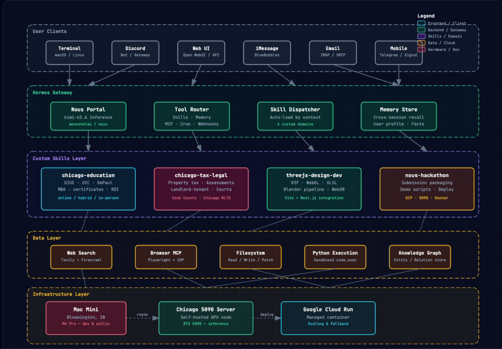

# Architecture v1 → v2 evolution

## v1 (deprecated)

A single Mercury Agent on the Chicago RTX 5090 with:
- **Two brains, role-split:** Mercury 4 405B as the planner, Kimi K2.6 as the coder.
- **Three demo skills hard-coded:** brain-viz, fmri-overlay, cortex-bridge — all behind a single Skill Loop block.
- **One node:** the 5090 in Chicago. Mac Mini and Cloud Run shown only as out-of-band fallbacks reached over the tailnet.
- **Discord-only client.** Other surfaces named but not actually wired.
- **GPU Scheduler swaps Gemma ⇄ TRIBE v2** under the agent loop.

This was the spec we shipped against in the SPEC.md / NOUS_HACKATHON.md drafts up through 2026-04-27. It worked, but it told a narrow story (brain-viz only) and conflated "what's actually running" with "what we said was possible."

## v2 (current — the version in the README hero)

Five concrete changes:

1. **One brain.** Kimi K2.6 via Nous Portal handles both planning and code-gen in a single chain-of-tools loop. Mercury 4 405B is gone from the hot path. Cheaper, faster, less prompt-routing surface area.

2. **Skill auto-load by domain context.** Replaces the hard-coded skill list with the new Skill Dispatcher (loads matching `*.skill.md` from disk based on the user's prompt) plus the **Mercury Curator** (week-of-2026-04-26 launch — keeps skills lean, prunes/consolidates unused ones, skips pinned + bundled). New domains drop in without touching the agent loop.

3. **Three-node mesh, one-command sync.** Mac Mini (Bloomington, M4 Pro) is now where skills are authored and tested. Chicago 5090 is the inference node. Google Cloud Run is the public fallback. `make sync` rsyncs `~/.mercury/skills` and `~/.mercury/config.yaml` across all three.

4. **Six client surfaces, all wired.** Terminal, Discord, Web UI (Open WebUI compat), iMessage (BlueBubbles), Email (IMAP/SMTP), Mobile (Telegram + Signal). The Mercury Gateway routes them all to the same Tool Router → Skill Dispatcher.

5. **Memory layer is real.** `Memory Store` does cross-session recall on user profile + environment facts (separate from per-session conversation memory which was already there). 4-domain skill set means very different conversation contexts; persistent memory is what stops them from blurring.

## Why we changed it

The v1 picture told the story of one very cool thing: "we built a brain visualizer." That's a **payload**, not a system. Judges already saw the cool brain demo on the demo video — they don't need the architecture to repeat it.

The v2 picture tells the story of an **agent stack** that *contains* the brain visualizer (under `threejs-design-dev`) plus three other domains that have nothing to do with neuroscience but everything to do with what people actually use Mercury for: solving local problems with multi-tool agents (chicago-education, chicago-tax-legal) and packaging their own submissions (nous-hackathon).

The v1 diagram is preserved here because it's accurate to the brain-viz subsystem. v2 is what the submission narrative leans on.

## What's on the GPU at any one moment (unchanged)

The 5090 still hosts one model at a time. The eviction-driven swap (gemma4:e4b 10 GB ⇄ gemma4:26b 19 GB ⇄ TRIBE v2 ~22 GB) hasn't changed and won't until we move to a 48 GB card. Both diagrams describe the same physical GPU; v2 just makes the rest of the system commensurate with what was already on the box.
